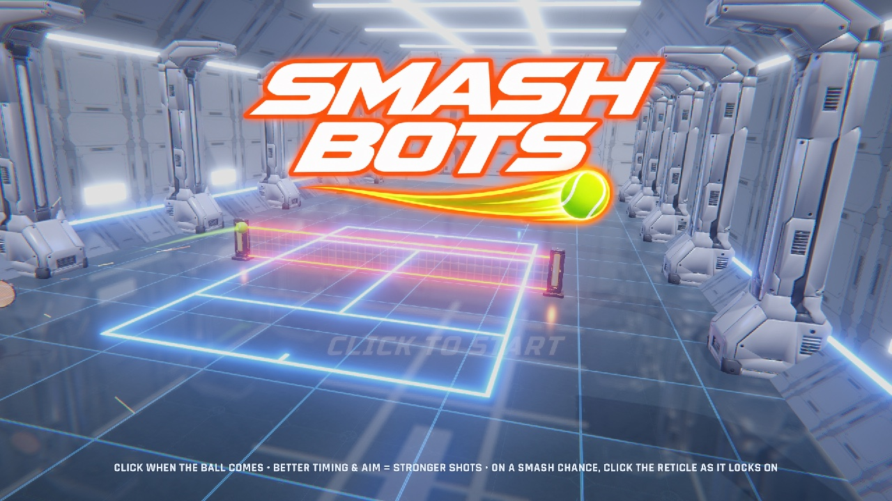
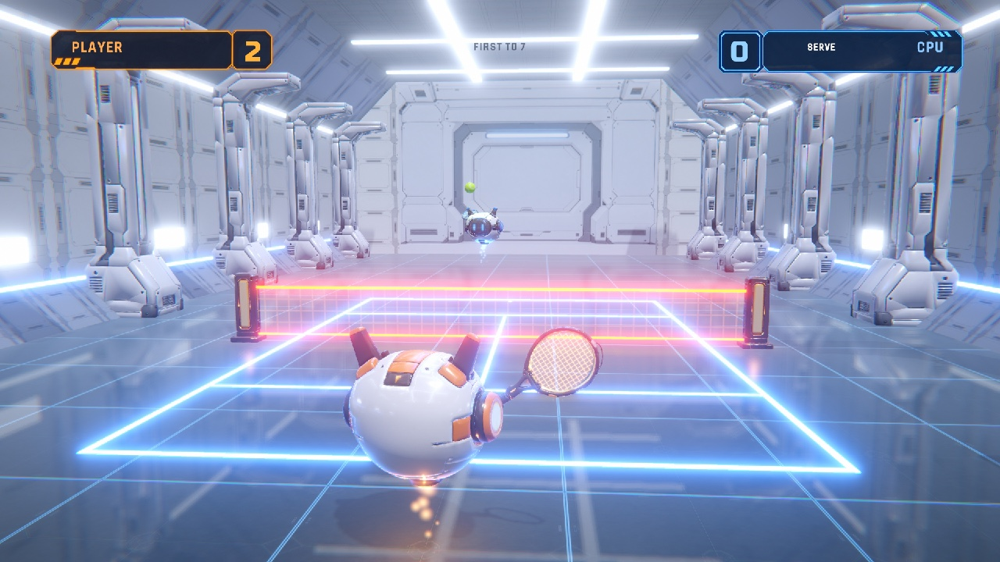
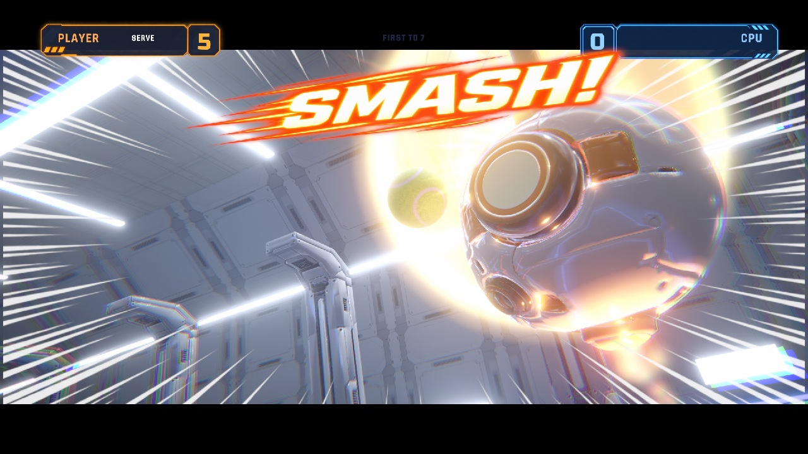

# Smash Bots

**Smash Bots** is a one-button tennis game played by hovering robots in a
sci-fi hall. Click (or tap) when the ball comes to hit it back: better timing
and aim give stronger shots. When the CPU sends up a weak lob, the game drops
into slow motion and shows a reticle; click it as it locks on to land a smash.

The project is built with Unity 6, and most of its assets (models, textures,
audio, UI images) were produced with generative AI tools.

## Requirements

- Unity 6000.6.4f1 or later
- Universal Render Pipeline

## Getting Started

Open the project in Unity, open `Assets/Main.unity` and enter Play mode.

## Runtime Overview

- `GameManager` – Game flow (title / attract mode, serve, rally, scoring).
- `PlayerController` – Click-timing and aim judgement for normal shots.
- `CpuController` – CPU opponent AI, including lobs that open a smash chance.
- `SmashDirector` – The smash sequence: slow motion, QTE reticle, cinematic
  camera and impact effects.
- `Ball`, `Trajectory`, `ShotPlanner` – Ball physics and shot solving.
- `CameraDirector`, `HudController`, `PostFxController`, `Effects`,
  `AudioController` – Presentation.

## Scene Builder

The whole scene (environment, robots, systems, materials and prefabs) is
generated from code. Run **Smash Bots > Build Scene** from the menu bar to
rebuild `Assets/Main.unity`. Edit the `SceneBuilder*.cs` files rather than the
scene itself, since changes made directly to the scene are lost on rebuild.

## Debug Flags

These static properties are handy for unattended testing, for example through
an editor script or a REPL in Play mode:

- `PlayerController.AutoPlay` – Hits every ball automatically.
- `CpuController.ForceLob` – Makes every CPU return a lob, which triggers a
  smash chance.
